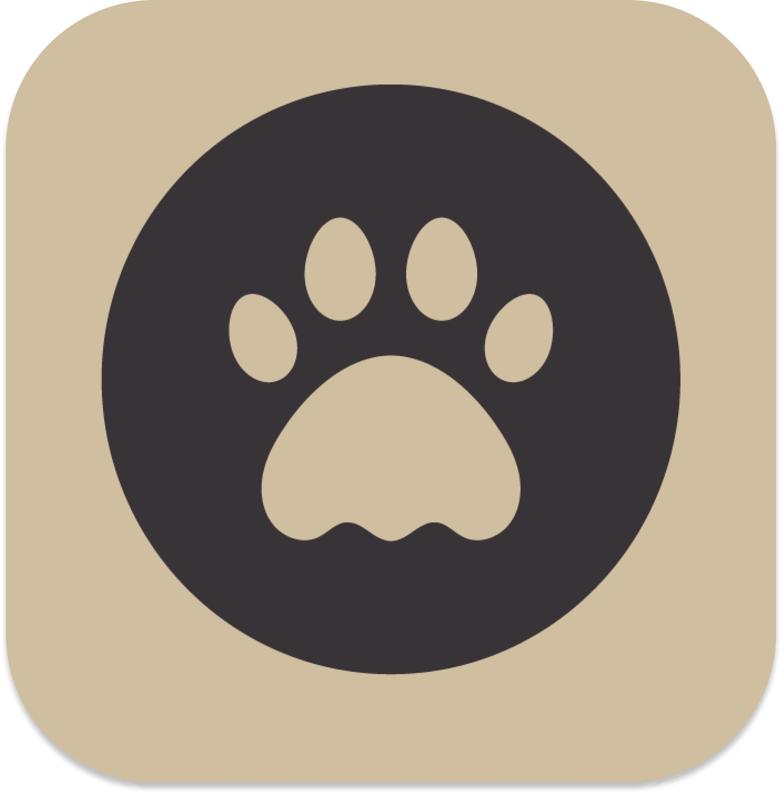

<!-- PROJECT LOGO -->
<br />
<p align="center">
  <a href="https://github.com/ahmedazagaz/TrainMyDog_app">
    
  </a>

  <h1 align="center">Project TrainMyDog</h1>

  <p align="center">
    Share, Learn, and Elevate Your Dog Training Skills 
    <br />
    <a href="https://trainmydog.framer.website"><strong>Visit the website »</strong></a>
    <br />
    <br />
    <a href="https://trainmydog.framer.website">View Demo</a>
    ·
    <a href="https://github.com/ahmedazagaz/TrainMyDog_app/issues">Report Bug</a>
    ·
    <a href="https://github.com/ahmedazagaz/TrainMyDog_app/issues">Request Feature</a>
  </p>
</p>

<!-- TABLE OF CONTENTS -->
## Table of Contents

* [About the Project](#about-the-project)
  * [Features](#features)
  * [Built With](#built-with)
* [Getting Started](#getting-started)
  * [Prerequisites](#prerequisites)
  * [Installation](#installation)
* [Usage](#usage)
* [Contributing](#contributing)
* [Contact](#contact)

<!-- ABOUT THE PROJECT -->
## About The Project

[![Product Screenshot][product-screenshot]](https://trainmydog.framer.website)

**TrainMyDog** is a community-driven platform for dog lovers who want to share, learn, and improve their dog training skills. The app enables users to watch training tutorials, upload their own videos, and engage with other trainers.

🐕 **What we offer for dog trainers**:

- 📹 Share and discover dog training videos.
- 📑 Bookmark videos to watch later.
- 🐾 Learn new techniques from professional trainers.

🐾 **What you can do**:

- 🚀 Share training experiences with the community.
- 📂 Organize your training history with easy-to-use profiles.
- 🏅 Elevate your dog training skills with structured tutorials.

## Features

- **Basic Obedience Training**: Learn basic commands like sit, stay, and come.
- **Advanced Training**: Videos on agility training, tricks, and more.
- **Community Sharing**: Share your own videos and tips with the community.
- **Video Bookmarking**: Save your favorite videos for easy access later.

<br />

## Built With

<p float="left">


</p>

<!-- GETTING STARTED -->
## Getting Started

To get a local copy up and running follow these simple steps.

### Prerequisites

- Figma for design
- Expo for mobile app development
- React Native for mobile app development
- Tailwind CSS for styling
- Appwrite for backend development


## Installation

1. Clone the repo:
      
 ```bash
  git clone https://github.com/ahmedazagaz/TrainMyDog_app.git

  ```
2. Install dependencies:
      
 ```bash
  cd TrainMyDog_app
  npm install
  ```
3. Connect Appwrite to the backend by following Appwrite documentation for setup:

- Set up your database, authentication, and storage.                
- Update the necessary API keys and endpoints in the project.

4. Start the Expo server:

 ```bash
   npx expo start
 ```
5. Use Expo Go to run the app on your device by scanning the QR code generated.

<!-- USAGE EXAMPLES -->

## Usage

L'application est organisée autour de quatre sections principales :

- **Home** : Accédez aux vidéos populaires et les plus récentes sur le dressage canin.
- **Bookmark** : Sauvegardez vos vidéos préférées pour les visionner plus tard.
- **Create** : Téléchargez vos propres vidéos de dressage canin et partagez vos expériences avec la communauté.
- **Profile** : Gérez votre compte, consultez vos vidéos postées, et suivez votre activité.

<!-- CONTRIBUTING -->

## Contributing
Contributions are welcome! If you have any suggestions, bug fixes, or feature requests, please open an issue or submit a pull request.

<!-- CONTACT -->

Contact
**LinkedIn:** [Ahmed Azagaz](https://www.linkedin.com/in/mochatr/)


